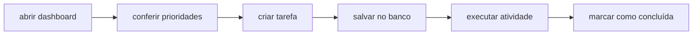

# StudyFlow

### Documento de Especificação de Requisitos e Qualidade

**Gestão e Qualidade de Software · A3 Prático**

**Instituição:** Ânima Educação

**Status:** MVP funcional · documentação em revisão final

> [!NOTE]
> Este documento apresenta o problema, os requisitos, os critérios de aceite, a estratégia de persistência e o plano de garantia da qualidade do StudyFlow.

## Sumário

- [1. Visão geral](#1-visão-geral)
- [2. Integrantes](#2-integrantes)
- [3. Matriz de requisitos](#3-matriz-de-requisitos)
- [4. Persistência e implantação](#4-persistência-e-implantação)
- [5. Fluxo crítico](#5-fluxo-crítico)
- [6. Cenários de QA](#6-cenários-de-qa)

## 1. Visão geral

### Problema

Estudantes concentram tarefas, leituras e avaliações em canais diferentes e perdem visibilidade sobre prioridades e prazos. Isso aumenta atrasos, retrabalho e a sensação de desorganização.

### Solução

O **StudyFlow** centraliza atividades acadêmicas em uma visão de rotina. Cada tarefa possui disciplina, prazo, prioridade e status, acompanhados por indicadores simples de progresso.

### Público-alvo

Estudantes de graduação que precisam acompanhar várias disciplinas e entregas semanais.

### ODS relacionada

**ODS 4 - Educação de Qualidade.** A aplicação apoia autonomia, organização e continuidade do processo de aprendizagem.

## 2. Integrantes

| Integrante | RA |
|---|---:|
| João Vitor Alves Rodrigues | 32513480 |
| Rafael Luiz Ferreira de Souza | 32511503 |
| Pietro Cardoso de Oliveira | 32515280 |
| Gustavo Henrique Ramos Gomes | 325141430 |
| Pedro Henrique Martins | 325130235 |

## 3. Matriz de requisitos

### Requisitos funcionais

| ID | Descrição | Prioridade | Critério de aceite |
|---|---|:---:|---|
| **RF-01** | Cadastrar tarefa com título, disciplina, prazo e prioridade. | Alta | Ao enviar o formulário, a nova tarefa aparece como pendente. |
| **RF-02** | Listar tarefas ordenadas por pendência e prazo. | Alta | Tarefas pendentes aparecem antes das concluídas. |
| **RF-03** | Concluir ou reabrir uma tarefa. | Alta | O controle visual altera o status e atualiza a contagem. |
| **RF-04** | Filtrar tarefas por todas, pendentes e concluídas. | Média | Cada filtro mostra somente os itens correspondentes. |
| **RF-05** | Exibir indicadores semanais de estudo. | Média | O dashboard mostra pendências, concluídas e horas de foco. |
| **RF-06** | Persistir tarefas em API Python e banco configurável. | Alta | A API mantém os dados após reinicialização do processo. |

### Requisitos não funcionais

| ID | Atributo | Prioridade | Critério de aceite |
|---|---|:---:|---|
| **RNF-01** | Usabilidade responsiva | Alta | O fluxo funciona em 360px, 768px e desktop sem rolagem horizontal. |
| **RNF-02** | Desempenho | Média | O dashboard local carrega em até 2 segundos em conexão comum. |
| **RNF-03** | Segurança de entrada | Alta | A API rejeita título vazio e prioridades fora da lista permitida. |
| **RNF-04** | Manutenibilidade | Média | O backend possui factory, banco isolado e testes automatizados. |
| **RNF-05** | Disponibilidade de desenvolvimento | Baixa | A CI executa testes Python e build frontend em cada PR para `main`. |

## 4. Persistência e implantação

O backend inicia com banco vazio por padrão, sem dados fictícios para o usuário final.

| Ambiente | Configuração | Finalidade |
|---|---|---|
| Desenvolvimento | SQLite local | Executar e testar sem infraestrutura externa. |
| Produção ou integração | MySQL via `STUDYFLOW_DATABASE_URL` | Persistência compartilhada da aplicação. |
| Demonstração | `STUDYFLOW_SEED_DEMO=true` | Popular dados somente quando necessário. |

O esquema da tabela `tasks` está disponível em [`backend/schema.mysql.sql`](../backend/schema.mysql.sql). A API mantém as mesmas rotas para o frontend independentemente do banco utilizado.

## 5. Fluxo crítico

1. O estudante abre o dashboard.
2. Confere pendências e prioridades.
3. Seleciona **Nova tarefa**.
4. Informa atividade, disciplina, prazo e prioridade.
5. Salva e visualiza a tarefa na lista.
6. Marca a atividade como concluída.

## 6. Cenários de QA

### QA-01 · Cadastro válido

- **Entrada:** título `Revisar capítulo 4`, disciplina `GQS`, prioridade `Alta`.
- **Passos:** abrir o modal, preencher os campos e enviar.
- **Resultado esperado:** a tarefa aparece como pendente e a contagem é atualizada.

### QA-02 · Conclusão de tarefa

- **Entrada:** uma tarefa pendente visível.
- **Passos:** clicar no círculo de conclusão.
- **Resultado esperado:** a tarefa recebe marca de concluída, o texto fica riscado e ela sai do filtro de pendentes.

### QA-03 · Validação de API

- **Entrada:** requisição `POST /api/tasks` sem título.
- **Passos:** enviar JSON sem o campo obrigatório.
- **Resultado esperado:** resposta HTTP `400`, sem registro incompleto.

### QA-04 · Responsividade

- **Entrada:** viewport de 360px, 768px e 1440px.
- **Passos:** navegar pelo dashboard e abrir o formulário.
- **Resultado esperado:** conteúdo sem sobreposição, menu acessível e formulário utilizável.

### Métricas de qualidade

- Taxa de cenários de QA aprovados.
- Cobertura dos testes unitários.
- Tempo de resposta da API.
- Ausência de erros no console.
- Build frontend aprovado na CI.
